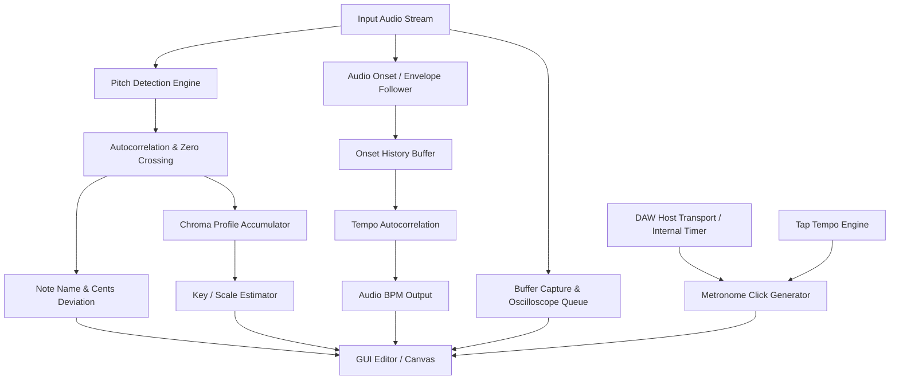

# 🎵 Supreme Tuner BPM

[](https://github.com/Vevikils/TUNER-BPM/releases/latest)
[](LICENSE)
[](https://juce.com/)
[](https://en.cppreference.com/w/cpp/17)
[](https://cmake.org/)
[]()

**Supreme Tuner BPM** is a modern, high-precision C++ audio plugin built with **JUCE 8** and **C++17**. It combines real-time chromatic pitch detection, musical scale/key detection, audio-driven BPM estimation, host-synchronized and internal metronomes, a tap tempo engine, and a live waveform oscilloscope into a unified, dark-themed GUI interface.

Developed by **[Vevikils](https://github.com/Vevikils)**.

---

## 📦 Quick Download (Pre-Compiled Binaries)

Don't want to compile from source? Download pre-built Windows binaries directly from the **[Releases Page](https://github.com/Vevikils/TUNER-BPM/releases/latest)**:

- 🎛️ **`SupremeTunerBPM.vst3`**: VST3 plugin for FL Studio, Ableton Live, Cubase, REAPER, Studio One, etc.
- 💻 **`SupremeTunerBPM.exe`**: Standalone executable application.

---

## ✨ Features

- 🎯 **Real-Time Chromatic Tuner**:
  - High-resolution fundamental frequency detection ($F_0$) via optimized time-domain autocorrelation and zero-crossing algorithm.
  - Sub-cent pitch deviation meter ($\pm 50$ cents offset gauge with smooth visual interpolation).
  - Western chromatic note detection ($C, C\#, D, D\#, E, F, F\#, G, G\#, A, A\#, B$).

- 🎼 **Musical Key & Scale Detection**:
  - Continuous pitch chroma accumulator analyzing harmonic spectrum profiles.
  - Automatically identifies Major and Minor key signatures (e.g. *C Major*, *A Minor*).
  - Dynamic statistical confidence rating output with manual accumulator reset capability.

- ⏱️ **Dual BPM & Metronome Engine**:
  - **Audio-Based BPM Detection**: Real-time envelope follower and onset history correlation for detecting tempo directly from input audio signals.
  - **Tap Tempo Engine**: Real-time tap tempo button utilizing sliding-window time interval averaging.
  - **DAW Transport Sync & Internal Metronome**: Flexible sync modes switching between host DAW playback transport and internal timer.
  - Adjustable metronome click generator with volume control and visual beat flash indicators.

- 📈 **Real-Time Waveform Oscilloscope**:
  - Thread-safe, lock-free double-buffered audio ring queue ($512$ samples).
  - Smooth visual wave rendering integrated directly into the custom GUI editor.

- 💻 **Cross-Platform Audio Formats**:
  - Ships as **VST3** for DAWs (FL Studio, Ableton Live, Cubase, Logic Pro, REAPER, Studio One) and as a **Standalone** application.

---

## 🛠️ Architecture & DSP Design



### Key Technical Specs

| Feature | Implementation Specification |
| :--- | :--- |
| **Framework** | JUCE 8.0.0 (via CMake `FetchContent`) |
| **Language Standard** | C++17 (`std::atomic`, `std::mutex`, `std::vector`) |
| **Pitch Detection** | Downsampled Autocorrelation ($8192$-sample ring buffer) |
| **BPM Detection** | 100 Hz Downsampled Onset History Autocorrelation |
| **GUI Refresh Rate** | 30 FPS (`juce::Timer` callback with smooth interpolation) |
| **Plugin Formats** | VST3, Standalone App |

---

## 🚀 Building from Source

### Prerequisites

- **CMake**: `3.22` or higher.
- **C++ Compiler**:
  - Windows: MSVC 2019 / 2022 (Visual Studio Community).
  - macOS: Xcode Clang (with Command Line Tools).
  - Linux: GCC 9+ or Clang 10+.
- **Git**: For cloning submodules/fetching dependencies.

### Build Steps (Windows / macOS / Linux)

1. **Clone the Repository**:
   ```bash
   git clone https://github.com/Vevikils/TUNER-BPM.git
   cd TUNER-BPM
   ```

2. **Configure with CMake**:
   ```bash
   cmake -B build -S . -DCMAKE_BUILD_TYPE=Release
   ```
   *Note: JUCE 8.0.0 will be automatically fetched and configured via CMake `FetchContent`.*

3. **Build the Target**:
   ```bash
   cmake --build build --config Release
   ```

4. **Output Location**:
   - **VST3 Plugin**: `build/TunerBPMPlugin_artefacts/Release/VST3/SupremeTunerBPM.vst3`
   - **Standalone Executable**: `build/TunerBPMPlugin_artefacts/Release/Standalone/SupremeTunerBPM.exe`

---

## 🎛️ Usage Guide

1. **VST3 Plugin in DAWs**:
   - Copy `SupremeTunerBPM.vst3` into your DAW's VST3 directory:
     - **Windows**: `C:\Program Files\Common Files\VST3\`
     - **macOS**: `/Library/Audio/Plug-Ins/VST3/`
     - **Linux**: `~/.vst3/`
   - Scan plugins in your host DAW (FL Studio, Ableton, Cubase, etc.) and insert **Supreme Tuner BPM** onto any audio track or master channel.

2. **Standalone Mode**:
   - Launch `SupremeTunerBPM.exe` directly for live tuning or metronome practice without opening a DAW.
   - Configure audio input/output settings in the Standalone options panel.

---

## 📁 Repository Structure

```
TUNER-BPM/
├── CMakeLists.txt              # CMake build configuration for JUCE 8
├── LICENSE                     # MIT License
├── README.md                   # Project documentation
├── .gitignore                  # Git ignore rules for CMake & JUCE outputs
└── Source/
    ├── PluginProcessor.h       # Audio processor interface & DSP buffer definitions
    ├── PluginProcessor.cpp     # DSP implementations (Pitch, Scale, Metronome, Audio BPM)
    ├── PluginEditor.h          # Custom GUI editor declaration & state caching
    └── PluginEditor.cpp        # Graphical rendering canvas & UI controls setup
```

---

## 📜 License

This project is licensed under the [MIT License](LICENSE) - see the LICENSE file for details.

Developed with ❤️ by **[Vevikils](https://github.com/Vevikils)**.
