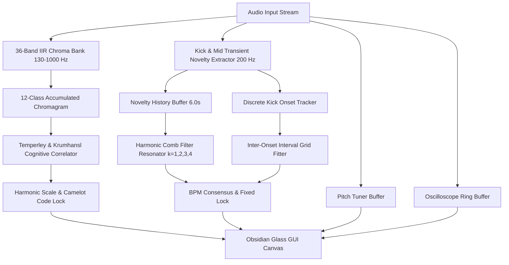

# 🎵 STT2 (SUPREME TEMPO & TUNER — BY VEVI)

[](https://github.com/Vevikils/TUNER-BPM/releases/latest)
[]()
[](LICENSE)
[](https://juce.com/)
[](https://en.cppreference.com/w/cpp/17)
[](https://cmake.org/)
[]()

**STT2 (Supreme Tempo & Tuner)** is a studio-grade, high-precision C++ audio plugin built with **JUCE 8** and **C++17**. It combines state-of-the-art polyphonic scale/key detection, an audio-driven harmonic comb filter tempo estimator, a real-time chromatic pitch tuner, and a live waveform oscilloscope into a luxury Apple-inspired obsidian glass interface.

Developed with precision by **[Vevikils](https://github.com/Vevikils)**.

---

## 📦 Quick Download (Pre-Compiled Windows Binaries)

Download the pre-compiled Windows binaries directly from the **[Releases Page](https://github.com/Vevikils/TUNER-BPM/releases/latest)**:

- 🎛️ **`STT2.vst3`**: VST3 plugin bundle for FL Studio, Ableton Live, Cubase, REAPER, Studio One, etc.
- 💻 **`STT2.exe`**: Standalone executable application for zero-latency standalone monitoring.

---

## ✨ Features (Version 2.2.0 PRO)

- 🎼 **Harmonic Key & Scale Detector (Polyphonic IIR Chromagram)**:
  - **36-Band IIR Semitone Filter Bank**: Analyzes octaves 3, 4, and 5 (130 Hz to 1000 Hz) where chords, synths, and vocal melodies reside, bypassing 808 sub-bass mud.
  - **Temperley (1999) Cognitive Key Profiles**: Gold-standard profiling tailored for modern pop, urban, trap, electronic, and contemporary music.
  - Displays detected scale (e.g. *F Major*, *D Minor*), Camelot wheel code (e.g. *7B*), and Relative Key signature.
  - Monotonic progress bar with definitive harmonic locking.

- 🥁 **Harmonic Comb Resonator & Kick Alignment Tempo Detector (BPM Engine)**:
  - **Multi-Band Novelty Flux (200 Hz / 5 ms)**: Isolates punchy kick thump (62 Hz bandpass + 110 Hz lowpass) and mid-range snare/clap transients (1200 Hz).
  - **Harmonic Comb Filter Resonator**: Evaluates constructive multi-harmonic beat alignment ($k = 1, 2, 3, 4$ beats) across candidate tempos in $[70, 185]$ BPM, completely eliminating polyrhythmic sub-harmonic false peaks (such as 156 BPM on a 106 BPM track).
  - **Kick Transient Interval Grid Alignment**: Measures inter-onset intervals between kick transients with millisecond precision against the candidate tempo grid.
  - Displays fixed locked tempo with discrete 4-beat visual LED metronome (zero audible clicks).

- 🎯 **Real-Time Chromatic Pitch Tuner**:
  - Zero-latency autocorrelation pitch tracking with cents deviation gauge ($\pm 50$ cents offset with smooth visual interpolation).

- 📈 **Organic Luminous Waveform Oscilloscope**:
  - Thread-safe, lock-free double-buffered audio ring buffer with glowing cyan dual-pass trace.

- 💎 **Studio Pro Minimalist Interface**:
  - Apple-inspired obsidian dark glass design with frosted glass cards, subtle neon accents, and responsive layout.
  - Official **`V.2`** luxury capsule badge and branding: `STT2` `[ V.2 ]` `|` `SUPREME TEMPO & TUNER — BY VEVI`.

---

## 🛠️ Architecture & DSP Design



---

## 🚀 Building from Source

### Prerequisites

- **CMake**: `3.22` or higher.
- **C++ Compiler**: MSVC 2019/2022 (Windows), Clang/Xcode (macOS), GCC 9+ (Linux).
- **Git**: For cloning and dependency resolution.

### Build Steps

```bash
# 1. Clone the repository
git clone https://github.com/Vevikils/TUNER-BPM.git
cd TUNER-BPM

# 2. Configure with CMake (automatically fetches JUCE 8.0.0)
cmake -B build -S . -DCMAKE_BUILD_TYPE=Release

# 3. Compile in Release mode
cmake --build build --config Release
```

Output files will be generated at:
- `build/TunerBPMPlugin_artefacts/Release/VST3/STT2.vst3`
- `build/TunerBPMPlugin_artefacts/Release/Standalone/STT2.exe`

---

## 📜 License

This project is licensed under the [MIT License](LICENSE).

Developed with ❤️ by **[Vevikils](https://github.com/Vevikils)**.
